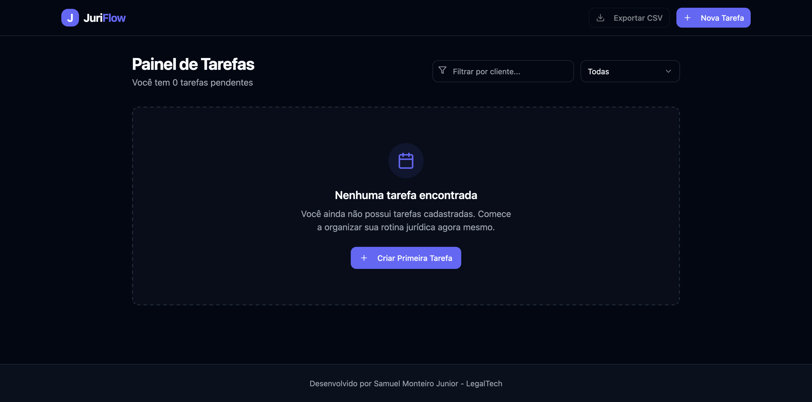

# JuriFlow ⚖️

**Gerenciador moderno de tarefas e processos para escritórios de advocacia**

To-do list jurídica evoluída para Next.js 15 — com interface nível SaaS 2026, shadcn/ui e animações fluidas.

## 📸 Interface do Dashboard
![JuriFlow Dashboard]

## Tecnologias
- Next.js 15 + TypeScript
- shadcn/ui + Radix UI + Tailwind CSS (Tema Premium Índigo/Dark)
- Zod (validação) + LocalStorage (pronto pra backend)
- Framer Motion (Animações suaves e micro-interações)
- Vercel-ready

## Funcionalidades
- **Gestão de Tarefas:** Criação de tarefas com prazos e prioridades (Baixa, Média, Alta).
- **Filtros Avançados:** Filtre por cliente ou status (Todas, Prazos vencidos, Esta semana).
- **Alertas Inteligentes:** Badges de prazo em vermelho (Atrasado) e Toasts dinâmicos de sucesso (Sonner).
- **Relatórios:** Exportação rápida de tarefas para planilhas CSV/Excel com um clique.
- **Design Hipermoderno:** Interface com suporte automático ao Dark Mode (next-themes) e responsividade mobile.

## Integrações LegalTech
Arquitetura pronta para conectar com Jusfy, Docket e PJe. Ideal para substituir planilhas e WhatsApp no dia a dia do escritório.

## Como rodar
```bash
git clone https://github.com/samuelmonteirotf/juriflow.git
cd juriflow
npm install
npm run dev
```
